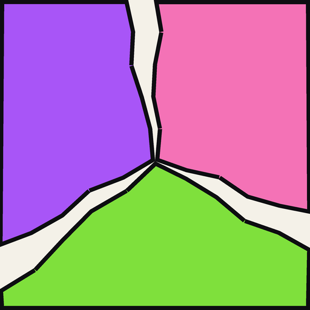

<h1>
  
  &nbsp;FST &nbsp;-&nbsp; Friendship Tracker
</h1>

A tally counter for your friendships. Everyone you want to keep up with gets
their own comic panel with a `+` and a `-`. Tap `+` when you actually spend
time with them.

"Am I being a bad friend" is easy to feel and hard to check. A number is harder
to argue with than a vibe.

**[Open the app](https://nokoding.github.io/FST/)**

## What you can do with it

- Keep separate pages for separate groups. The people you text, the people you
  see, whatever split makes sense to you.
- Give each person a look of their own: a color gradient, a picture, a banner,
  a frame, tags, and a few lines about them.
- See who you have been neglecting. The dashboard draws the counts as a pie, a
  donut, bars, rings, a radar or a disk map.
- Reset the count weekly, monthly, on your own schedule, or never. The all time
  total never resets.

## Getting it

It opens in a browser and installs onto a phone or a computer like a normal
app, with its own icon. Nothing to buy, no account to make, no ads. Once it is
installed it works with no internet at all.

[Start here](docs/start-here.md) for the install, and
[how to use it](docs/using-it.md) once you are in.

## Where your stuff lives

On your device, and nowhere else. Nothing is uploaded, nothing is tracked, and
there is no account attached to any of it.

That cuts both ways. If you clear your browser data, it is gone. So either save
a backup file now and then, which is one tap in Settings, or turn on
[sync](docs/sync.md) and let it keep a copy in your own Google Drive.

## More

- [Start here](docs/start-here.md), getting it onto your phone or computer.
- [Using it](docs/using-it.md), pages, counting, the dashboard, backups.
- [Sync](docs/sync.md), keeping two devices in step.
- [Host your own copy](docs/hosting.md), if you would rather run it yourself.
- [Developing](docs/developing.md), the commands, the build, the layout.
- [How it works inside](docs/architecture.md), for the curious.

## Open source

Free, MIT licensed, and the whole thing is in this repo. Fork it, change it,
run your own. See [developing](docs/developing.md) to get started, or
[contributing](CONTRIBUTING.md) if you want to send a change back.

## License

MIT, see [LICENSE](LICENSE).
